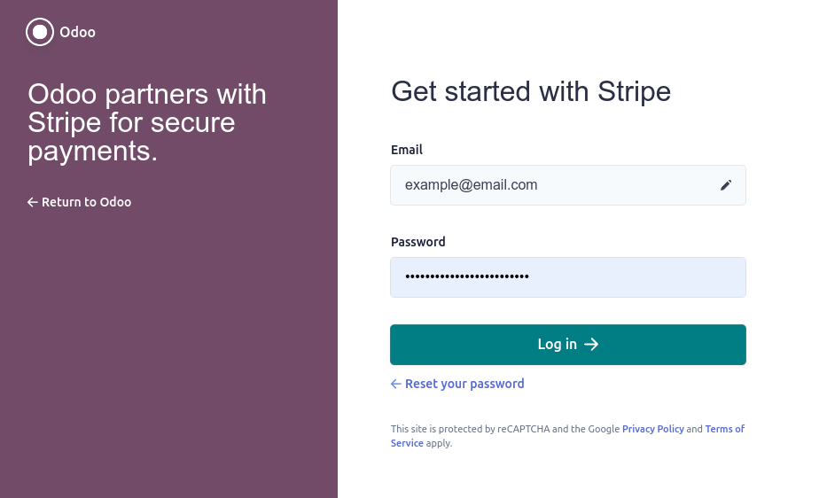

======
Stripe
======

Connecting a payment terminal allows you to offer a fluid payment flow to your customers and ease
the work of your cashiers.

Configuration
=============

Create your Stripe account
--------------------------

Start by creating your **Stripe** account on `Stripe's website <https://dashboard.stripe.com/register>`_.

.. seealso::
   - `Stripe Documentation <https://stripe.com/docs/payments?payments=popular>`_.

Configure the payment method
----------------------------

Create the payment method
+++++++++++++++++++++++++

Start by activating **Stripe** in the settings. From the **POS** dashboard, go to
:menuselection:`Configuration --> Settings --> Payment Terminals --> Check Stripe`. Then, create the
payment method. Scroll up to :guilabel:`Payment`, click :menuselection:`Payment Methods --> Create
--> Name it.` Set the :guilabel:`Journal` field as :guilabel:`Bank` and the :guilabel:`Use a
Payment Terminal` field as :guilabel:`Stripe`. Enter your payment terminal serial number in the
:guilabel:`Stripe Serial Number` field. Lastly, click on :guilabel:`Don't forget to complete Stripe
connect before using this payment method.`

.. image:: stripe/create-method-stripe.png

.. note::
   - Find your payment terminal serial number under the device or on `Stripe's website <https://dashboard.stripe.com/register>`_.

Connect Stripe to Odoo
++++++++++++++++++++++

Click on :guilabel:`Connect Stripe`. You are redirected to a configuration page. Follow the
instructions to connect your terminal.

Once the process is over, the :guilabel:`Publishable Key` and the :guilabel:`Secret Key` are
automatically completed.

.. important::
   - When you use **Stripe** exclusively in PoS, you only need the **Secret Key** to use your
     terminal.
   - The :guilabel:`State` is inherent to **eCommerce** and can stay set as :guilabel:`Disabled`.
   - For **On-Premise** users, the :guilabel:`Connect Stripe` button does not work. To retrieve the
     keys manually, go to `Stripe's website <https://dashboard.stripe.com/register>`_, log in, type
     `API` in the search bar, and click :guilabel:`Developers > API`.

Configure the payment terminal
++++++++++++++++++++++++++++++

Swipe right on your payment terminal, click :menuselection:`Settings --> enter 07319 --> Validate
--> Network`, and select your network.

.. note::
   - The device must be connected to a secured WIFI.
   - Your **Odoo** database and payment terminal must share the same network.
   - To access your payment terminal settings, you must enter the admin pin code `07139`.

Add a new payment method
========================

To add a new **payment method** to your point of sale, go to :menuselection:`Point of Sale -->
Configuration --> Settings`. Then, select the POS, go to :menuselection:`Payments --> Payment
Methods`, and add your new method for **Stripe**.

Pay with a payment terminal
===========================

When processing a payment, select :guilabel:`Stripe` as the payment method. Check the amount and
click on :guilabel:`Send`. Once the payment is successful, the status changes to :guilabel:`Payment
Successful`.

.. note::
   - | In case of connexion issues between Odoo and the payment terminal, force the payment by
       clicking on :guilabel:`Force Done`, which allows you to validate the order.
     | This option is only available after receiving an error message informing you that the
       connection failed.
   -   To cancel the payment request, click on :guilabel:`cancel`.
   -   The terminal must have at least 10% battery to use it.
   -   The device does not work for payments under €0.50.

Troubleshooting
===============

You cannot find the payment terminal in your Stripe account.
------------------------------------------------------------

Create a terminal on Stripe's website by clicking on the :guilabel:`New` button. To do so, you must
provide a **registration code**. To retrieve that code, swipe right on your device, enter the admin
PIN code `07319`, validate, and click on :guilabel:`Generate a registration code`.
