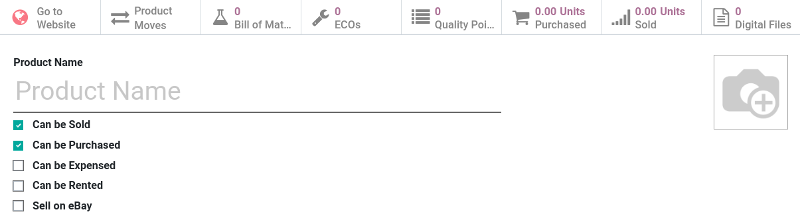
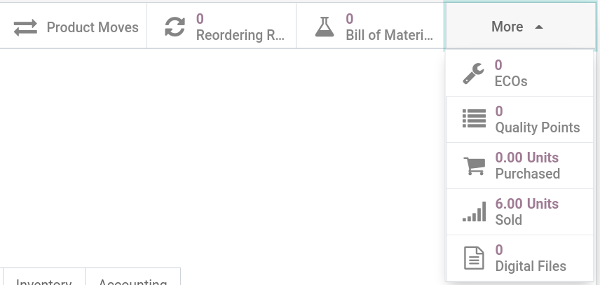
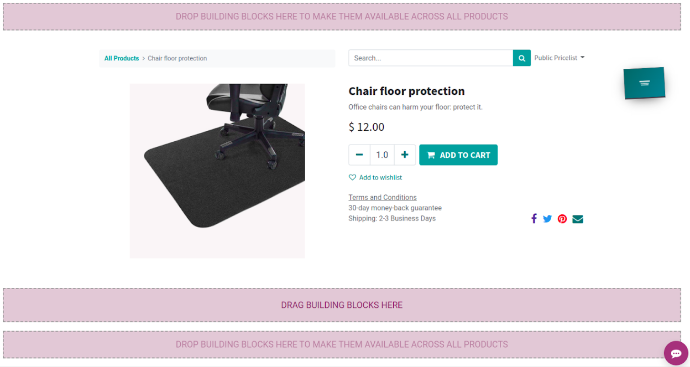

====================
Build a product page
====================

Adding a new product can be done in multiple ways:

- From the front-end, by clicking on :menuselection:`+ New --> Product`;

- From the back-end, by going to :menuselection:`Products --> Products --> Create`. Alternatively,
  you can click on an **existing** product and select :menuselection:`Action --> Duplicate` to copy
  an existing product.

Basic product configuration
===========================

Product image
-------------

To add an **image** to your product, hover over the camera icon and click on the :guilabel:`Edit`
button (in the shape of **pencil**). Select the image you wish to use. The product image is used as
the first image and thumbnail of the product across all website(s). Make sure to use only good
quality and explicit images.

.. tip::
   Use .JPG or .PNG format with at least `1024px` height or width.

Product configuration
---------------------

On the product from, specify its nature by checking one or multiple options:

- :guilabel:`Can be Sold`: the product can be sold to customers;
- :guilabel:`Can be Purchased`: the product can be purchased from vendors;
- :guilabel:`Can be Expensed`: the product can be added as an expense;
- :guilabel:`Can be Rented`: the product can be rented by the customer for a select period;
- :guilabel:`Sell on eBay`: the product can be listed on eBay.

Then, select a :guilabel:`Product Type`:

- :guilabel:`Consumable`: this type is intended for consumable products (ex.: with expiry dates);
- :guilabel:`Service`: this type is intended for service-based products (ex.: consulting);
- :guilabel:`Storable Product`: this type is intended for storable products, and is mandatory in
  order to display the **stock level** on the product page. This field is *only* available when the
  :doc:`Inventory app <../../../inventory_and_mrp/inventory>` is installed.

Invoicing policy
----------------

To define when an invoice is sent to the customer, an **invoicing policy** needs to be defined. For
this, head to the :guilabel:`Sales` tab from within the **product form**, and check the option
according to your needs.

- :guilabel:`Ordered quantities`: the invoice is issued when the order is created;
- :guilabel:`Delivered quantities`: the invoice is issued after delivery, based on the quantities
  *delivered*, not ordered.

Translated fields
-----------------

When multiple languages are available on the website, the following fields must be translated:

- Product name;
- Sales description;

.. tip::
   Make sure all fields are translated. Having untranslated content on a web page may be detrimental
   to the user experience and therefore, your SEO.

Website ID
----------

A product can be available on a specific website or on all websites. To select the availability of a
product on a website, head to the :guilabel:`eCommerce` tab of the product form. Then, in the
:guilabel:`Website` field, select the website(s) you wish to have the product available.

.. note::
   When more than two websites are available, it is not possible to display the product only in
   specific websites and not others. For instance, if you have three websites, you will not be able
   to display a product in only two of them.

Digital files
-------------

It is possible to add a **download link** for customers at the end of the checkout. To do that, make
sure to enable the feature in the website settings (:menuselection:`Website --> Configuration -->
Digital Content`) and add a digital file to the product template.

Then, on the **product form**, click on :menuselection:`More --> Digital Files --> Create`. Enter a
**name** for your file, select a **type**, **upload** your file, and finally select the applicable
**website(s)**.

Stock management
----------------

You can define an eCommerce **selling strategy** for your product. By going to the
:guilabel:`eCommerce` tab on the product form, you can select a strategy in the
:guilabel:`Availability` field:

- :guilabel:`Sell regardless of inventory`: customers can still order the product even if it is out
  of stock, but they will only receive it when the stock is replenished.

- :guilabel:`Show inventory on website and prevent sales if not enough stock`: the exact stock level
  is constantly displayed on the website, and customers cannot order if out-of-stock.

- :guilabel:`Show inventory below a threshold and prevent sales if not enough stock`: the stock
  level is only displayed under a certain stock level, and customers cannot order if out-of-stock.

- :guilabel:`Show product-specific notifications`: displays a message on the product's page to
  notify the product is out of stock. The message displayed can be customized.

.. tip::
   The online selling strategy usually depends on the type of product, the time to stock and the
   type of stock management (make to order, make to stock, drop-ship).

Design the product page
=======================

Once the product has been created, the next step is to design the product page. To do that, simply
click the :guilabel:`Go to Website` tab on the product form. You can also search the product from
the website page, by going into :guilabel:`Shop` and searching for the product in the
:guilabel:`Search` field.

.. tip::
   The font's color of the :guilabel:`Go to Website` tab depends on the visibility of the product.
   Green meaning it is **published** and visible by visitors, red meaning it is **unpublished** and
   only visible to you.

Layout
------

When on the *front-end* page of the product, click :guilabel:`Edit` to prompt-up the page-editing
menu. From the menu, click the :guilabel:`Blocks` or :guilabel:`Options` tab to access the different
drag-and-drop building blocks available and advanced customization options.

Building blocks
---------------

**Building blocks** can be dropped in specific areas defined specifically for this purpose. If you
place a building block *under* the product information, it will only be visible on this **specific
product page**. The **HTML** is stored on the product template record under the
:guilabel:`website_description` field.

If you drop a building block at the *top* or *bottom* of the page, it will be visible on
**all product pages**. The **HTML** is stored on the **QWeb** view.

Add extra features
------------------

Additional features can be added on the product page, either from the web builder using building
blocks, or through the website settings.

Features from the web builder include:

- Customer ratings
- Social sharing
- Quantity selector
- Alternative products
- Wishlist
- Product specification
- ...

It is also possible to add a **product comparison tool** by enabling it in :menuselection:`Website
backend --> Configuration --> Settings --> Products`.

Publish the product
-------------------

The final step is to publish a product on your eCommerce website. From the **product page**, click
on the **toggle button** at the top of the page, effectively switching it from
:guilabel:`Unpublished` to :guilabel:`Published`.

.. tip::
   Once a product is published, the product page is available for indexing by web crawler and
   product information will be available online.